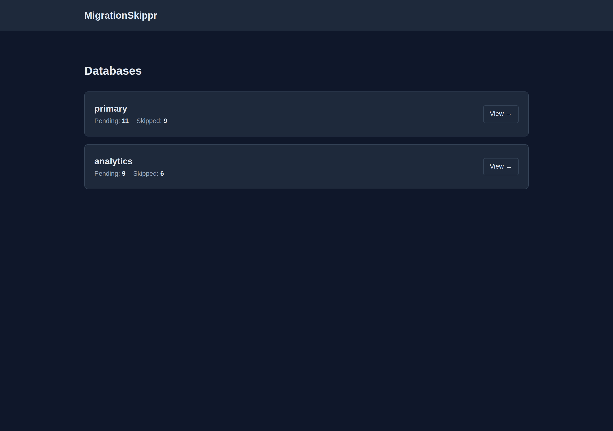
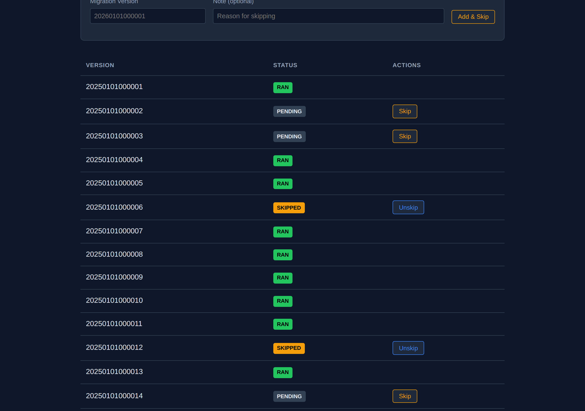

# MigrationSkippr

A Rails engine for skipping (faking) database migrations and unskipping them later. Supports multiple databases, an append-only audit trail, and Pundit-based authorization.

**Use case:** You need to deploy but a migration isn't ready to run yet. Skip it in `schema_migrations` so Rails thinks it already ran, then unskip it later when you're ready.





## Installation

Add to your Gemfile:

```ruby
gem "migration_skippr"
```

Run the installer:

```bash
rails generate migration_skippr:install
rails db:migrate
```

Mount the engine in `config/routes.rb`:

```ruby
mount MigrationSkippr::Engine, at: "/migration_skippr"
```

## Configuration

The installer creates `config/initializers/migration_skippr.rb`:

```ruby
MigrationSkippr.configure do |config|
  # Lambda that receives the request and returns the current actor (string).
  # Used for audit trail. If not configured, actor will be nil.
  config.current_actor = ->(request) { request.env["warden"].user&.email }

  # Which database to store migration_skippr_events in.
  # Defaults to :primary.
  config.tracking_database = :primary

  # Pundit policy class for authorization.
  # Default policy denies all access — you must override this.
  config.authorization_policy = "MyApp::MigrationPolicy"
end
```

## Authorization

The default policy **denies all access**. Create your own policy to control who can view and manage migrations:

```ruby
class MyApp::MigrationPolicy < MigrationSkippr::MigrationPolicy
  def index?  = actor&.admin?
  def show?   = actor&.admin?
  def skip?   = actor&.admin?
  def unskip? = actor&.admin?
  def create? = actor&.admin?
end
```

## Multi-database support

MigrationSkippr automatically discovers all writable databases configured in `database.yml`. Each database's migrations are tracked independently.

## Programmatic API

```ruby
# Skip a migration
MigrationSkippr.skip("20240101000001", database: "primary", actor: "alice", note: "Not ready")

# Unskip a migration
MigrationSkippr.unskip("20240101000001", database: "primary", actor: "alice", note: "Ready now")

# Check status
MigrationSkippr.status("primary")

# View history for a specific migration
MigrationSkippr.history("primary", "20240101000001")
```

## Requirements

- Ruby >= 3.2
- Rails >= 7.1, < 9.0
- Pundit >= 2.3

## License

MIT License. See [LICENSE.txt](LICENSE.txt).
